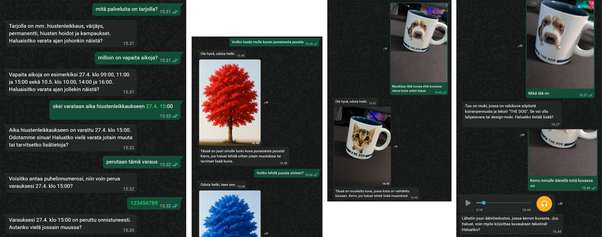

# WhatsApp AI Assistant



## Overview

WhatsApp AI Assistant is an intelligent chatbot that brings AI capabilities directly to WhatsApp conversations. Developed as a proof-of-concept at [GPT Lab Seinäjoki](https://www.tuni.fi/en/research/gpt-lab-seinajoki) AI Research Initiative, this project demonstrates how modern language models can be integrated into everyday messaging platforms to create helpful, context-aware conversational experiences.

The assistant connects to WhatsApp using the Neonize framework (a Python wrapper for Whatsmeow) and leverages OpenAI's API to provide intelligent responses across multiple languages. What sets it apart is its ability to understand context from previous conversations, process shared links and documents, and use various AI tools like image generation and web search to enhance interactions.

<div align="center">

**Built for educational and demonstration purposes to showcase AI-driven automation in messaging platforms.**

</div>

## Key Features

### Core Capabilities

- **WhatsApp Integration**: Seamless connection to WhatsApp through Neonize, with QR code authentication
- **Context-Aware Conversations**: Maintains conversation history in SQLite database for contextual responses
- **Multi-Language Support**: Automatically detects and responds in the user's language
- **Rate Limiting**: Built-in protection against spam with configurable message limits

### AI-Powered Tools

The assistant can intelligently select and use various tools based on user requests:

- **Image Generation**: Create images from text descriptions using OpenAI's image models
- **Image Editing**: Edit previously generated images with natural language instructions
- **Text-to-Speech**: Convert text responses to audio messages
- **Web Search**: Fetch up-to-date information from the internet when needed
- **Vision**: Analyze and describe images shared in conversations

### Content Processing

- **Link Scraping**: Automatically extracts and processes text from URLs shared in messages
- **Document Processing**: Reads and extracts text from PDF and DOCX files
- **Image Analysis**: Describes images shared by users using GPT-4 Vision
- **Audio Transcription**: Converts voice messages to text with Whisper

### Scenario System

Supports multiple pre-configured scenarios with specialized tools and prompts:

- **Base**: General-purpose assistant with core tools
- **Hairdresser**: Appointment booking, service inquiries, and calendar management
- **Car Parts Retailer**: Vehicle information lookup and parts ordering
- **Bookstore**: Book recommendations and inventory queries

Each scenario can have custom prompts and specialized tool sets tailored to specific business needs.

## Installation

### Prerequisites

- Python 3.8 or higher
- OpenAI API key with access to GPT-4 and other services
- WhatsApp account for bot connection

### Setup

1. **Clone the repository**

```bash
git clone https://github.com/your-username/whats-ai-assistant.git
cd whats-ai-assistant
```

2. **Create and activate a virtual environment (recommended)**

```bash
python -m venv venv
# On Windows:
venv\Scripts\activate
# On Unix or MacOS:
source venv/bin/activate
```

3. **Install dependencies**

```bash
pip install -r requirements.txt
```

4. **Configure the environment**

Create a `.env` file in the root directory (use `example.env` as a template):

```env
OPENAI_API_KEY=your-openai-api-key-here
ASSISTANT_NAME=KoodattuBotti
SCENARIO=base
OPENAI_MODEL_NAME=gpt-4o-mini-2024-07-18
```

5. **Customize settings** (optional)

Edit `config.py` to adjust:

- `MAX_MESSAGES`: Number of previous messages to include as context (default: 10)
- `SKIP_HISTORY_SYNC`: Skip processing old messages on startup (default: True)
- `SCRAPE_USER_LINKS`: Enable/disable automatic link scraping (default: False)
- `DOWNLOAD_USER_FILES`: Enable/disable file download and processing (default: False)

## Usage

### Starting the Assistant

Run the main script to start the bot:

```bash
python main.py
```

On first run, Neonize will display a QR code in the console. Scan this with your WhatsApp mobile app (Settings → Linked Devices → Link a Device) to authenticate the bot.

Once connected, the assistant will:

- Listen for incoming messages
- Automatically respond based on the configured scenario
- Store all conversations in the SQLite database
- Use AI tools when appropriate to enhance responses

### Commands

The assistant supports several administrative commands:

- `/clear` - Clear conversation history for your user session
- Additional commands can be found in the source code

### How It Works

1. **Message Reception**: When a user sends a message, the bot marks it as read and adds it to the processing queue
2. **Context Building**: Retrieves recent conversation history and any additional content (scraped links, documents, images)
3. **Tool Selection**: The LLM intelligently decides if any tools are needed (image generation, web search, etc.)
4. **Response Generation**: Generates a contextual response in the user's language
5. **Message Sending**: Sends the response back to the user with appropriate WhatsApp presence indicators (typing, paused)

### Customizing Scenarios

To create a custom scenario:

1. Define a new class in `scenarios.py` that inherits from `Scenario`
2. Set the scenario name and customize the `final_response_prompt`
3. Define custom tools using Pydantic models and `openai.pydantic_function_tool`
4. Implement tool handlers in `tool_calls.py` or `tool_calls_dummy.py` for mock responses
5. Update the `.env` file to use your new scenario: `SCENARIO=your_scenario_name`

## Project Structure

```
whats-ai-assistant/
├── main.py                  # Application entry point and event handlers
├── config.py                # Configuration settings and environment variables
├── whatsapp.py              # WhatsApp message handling and processing logic
├── llm.py                   # OpenAI API integration and response generation
├── scenarios.py             # Scenario definitions and tool configurations
├── prompts.py               # System prompts for different scenarios
├── tool_calls.py            # Tool implementations (image gen, TTS, web search, etc.)
├── tool_calls_dummy.py      # Mock tool responses for testing
├── database.py              # SQLite conversation history management
├── scraping.py              # Web scraping and content extraction
├── filelogger.py            # Debug logging utilities
├── requirements.txt         # Python dependencies
├── example.env              # Environment variable template
├── README.md                # This file
├── LICENSE                  # MIT license
├── db/                      # SQLite databases (auto-created)
├── messages/                # Raw message dumps for debugging (auto-created)
├── downloads/               # Downloaded files from users (auto-created)
├── images/                  # Generated and processed images (auto-created)
└── audio/                   # Generated audio files (auto-created)
```

### Key Components

- **main.py**: Sets up the Neonize client, handles connection events, and manages the message queue
- **whatsapp.py**: Core message processing logic including rate limiting, file handling, and response coordination
- **llm.py**: Wrapper functions for OpenAI API calls with error handling
- **scenarios.py**: Defines different bot personalities and available tools for each scenario
- **tool_calls.py**: Implements the actual tool functionality (image generation, TTS, vision, web search)
- **database.py**: Manages SQLite operations for storing and retrieving conversation history

## Technical Details

### Dependencies

- **neonize**: WhatsApp Web API wrapper
- **openai**: OpenAI API client for LLM, image generation, TTS, and speech recognition
- **beautifulsoup4**: HTML parsing for web scraping
- **requests**: HTTP client for web requests
- **pdfplumber**: PDF text extraction
- **python-docx**: Word document processing
- **Pillow**: Image processing
- **ddgs**: DuckDuckGo search integration
- **python-dotenv**: Environment variable management

### Rate Limiting

The bot implements rate limiting to prevent abuse:

- Maximum 5 messages per user within a 30-second window
- Messages older than 1 minute are automatically ignored
- Configurable per-user limits

### Data Storage

- Conversation history stored in SQLite database (`db/conversations.sqlite3`)
- Neonize authentication data stored separately (`db/neonize.sqlite3`)
- Raw message objects saved as text files for debugging
- Generated media files organized in separate directories

## Use Cases

This project demonstrates several practical applications of AI in messaging:

- **Customer Service Automation**: Handle common inquiries and provide instant responses
- **Appointment Scheduling**: Book, check, and cancel appointments through natural conversation
- **Information Lookup**: Search the web or internal databases to answer user questions
- **Document Processing**: Extract information from PDFs and documents shared by users
- **Content Generation**: Create images, audio, or text content based on user requests
- **Multi-Language Support**: Serve international users in their preferred language

## Important Notes & Limitations

⚠️ **Use at Your Own Risk**: This project uses unofficial WhatsApp APIs and may violate WhatsApp's Terms of Service. Use only for educational and testing purposes with accounts you're prepared to lose access to.

### Limitations

- WhatsApp may ban accounts using unofficial APIs
- OpenAI API usage incurs costs based on usage
- Rate limiting is basic and may need enhancement for production use
- No end-to-end encryption for stored messages
- Image editing requires previously generated images in the session
- Some features require specific OpenAI model access

### Security Considerations

- Store API keys securely and never commit them to version control
- The SQLite database contains conversation history in plain text
- Raw message objects are saved to disk for debugging
- Consider implementing additional authentication for production deployments

## Acknowledgments

This project utilizes several open-source libraries and APIs:

- **[Neonize](https://github.com/krypton-byte/neonize)**: Python library that provides WhatsApp Web API access
- **[Whatsmeow](https://github.com/tulir/whatsmeow)**: Go library that Neonize wraps for WhatsApp protocol implementation
- **[OpenAI API](https://openai.com/)**: Powers the language understanding, image generation, and speech capabilities
- **[GPT Lab Seinäjoki](https://www.tuni.fi/en/research/gpt-lab-seinajoki)**: AI Research Initiative where this proof-of-concept was developed

## Contributing

1. Fork the repository.
2. Create a feature branch: `git checkout -b feature-name`
3. Commit your changes: `git commit -m "Add feature"`
4. Push to the branch: `git push origin feature-name`
5. Open a Pull Request.

## License

This project is licensed under the MIT License - see the [LICENSE](LICENSE) file for details.

## Contact

For questions or support, feel free to open an issue or reach out to Juha Ala-Rantala at [juha.ala-rantala@tuni.fi](mailto:juha.ala-rantala@tuni.fi).
